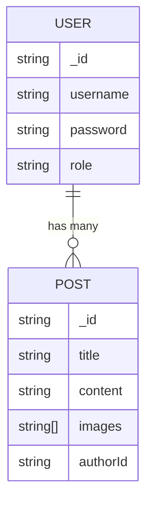

# 🚀 Blog Platform API (Backend)

A RESTful API for a blog platform built with **NestJS**, **MongoDB**, and **TypeScript**. Supports user authentication, blog post management, and image uploads.


## ✨ Features

- **JWT Authentication**  
  Secure user registration/login with role-based access control.
- **Blog Post CRUD**  
  Create, read, update, and delete posts with ownership validation.
- **Image Uploads**  
  Cloudinary integration for storing post images.
- **Planned Extensions**  
  Likes/favorites system, comments, and user profiles.

## 📦 Installation

1. Clone the repo:

   ```bash
   git clone https://github.com/yourusername/blog-platform-api.git
   ```

2. Install dependencies:

   ```bash
   npm install
   ```

3. Configure environment variables (create `.env` file):

   ```env
   DATABASE_URI=mongodb://your_connection_string
   JWT_SECRET=your_jwt_secret_key
   CLOUDINARY_CLOUD_NAME=your_cloud_name
   CLOUDINARY_API_KEY=your_api_key
   CLOUDINARY_API_SECRET=your_api_secret
   ```

4. Run the server:

   ```bash
   npm run start:dev
   ```

## 🛠️ API Endpoints

| Method | Endpoint           | Description                     | Auth Required |
|--------|--------------------|---------------------------------|---------------|
| POST   | `/auth/register`   | Register new user               | No            |
| POST   | `/auth/login`      | Login user                      | No            |
| GET    | `/posts`           | Get all posts                   | No            |
| POST   | `/posts`           | Create new post                 | Yes           |
| PATCH  | `/posts/:id`       | Update post (owner/admin only)  | Yes           |

*Full API documentation available in [API_DOCS.md](API_DOCS.md)*

## 🗄️ Database Schema



## 🤝 Contributing

1. Fork the project
2. Create a new branch (`git checkout -b feature/your-feature`)
3. Commit changes (`git commit -m 'Add some feature'`)
4. Push to branch (`git push origin feature/your-feature`)
5. Open a Pull Request

## 📄 License

MIT

```

### Key Notes:
1. **Badges** - Visual tech stack indicators (customize colors/logos if needed)
2. **Minimal ENV Setup** - Only critical variables shown
3. **Mermaid Diagram** - GitHub supports this for ER diagrams
4. **Extension-Ready** - Placeholders for future features (likes/comments)

Want me to:
- Add a **"Running Tests"** section?
- Include sample **API request/response** snippets?
- Expand the **roadmap** with specific milestones?
